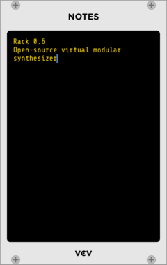

# Core

The *Core* plugin is actually not a plugin at all.
It's built in to the Rack application itself, but you can add Core modules to your rack just like normal modules.

### Audio

The *Audio* module merges the virtual Rack world with the physical hardware world.
The **INPUT** section sends up to 8 Rack signals to a hardware audio device for playback, and the **OUTPUT** section sends up to 8 hardware signals into Rack.

*Audio* currently supports the following **drivers**.
- Core Audio on Mac
- WASAPI and ASIO on Windows
- ALSA on Linux
- [VCV Bridge](Bridge.md) on all OS's, although there are no Bridge plugins for Linux at this time

After a driver is selected, a particular **device** can be chosen for the driver.
If the device has more than 8 inputs or outputs, you can select the desired range of outputs, offset by a factor of 8.

The **sample rate** is the number of audio samples per second for the audio device to process.
Note that this rate is different than Rack's internal sample rate set from the [toolbar](Toolbar.md), which determines the number of samples per second for virtual Rack modules to process.
If set to different rates, sample rate conversion will occur, resulting in slightly higher CPU usage, slightly less audio fidelity, and slightly more latency.

The **block size** sets the number of samples to store in the audio buffer before releasing to the audio device.
A higher size results in more latency (`blockSize / sampleRate` seconds), but a lower size requires your operating system to communicate with the audio device more frequently, resulting in potentially less audio stability.
A good balance can be found by increasing the block size until no audio "glitches" are heard.

Note: Using multiple Audio modules is experimental and may crash Rack or render unstable audio.
Most DAWs avoid this feature entirely by restricting audio to a single input and a single output device for stability reasons, but if using multiple audio devices in Rack works with your configuration, more power to you!

### MIDI-1

*Coming soon*

### MIDI-4

*Coming soon*

### MIDI-CC

*Coming soon*

### MIDI-Trig

*Coming soon*

### Blank

Useful for adding space between modules in your rack.
You can resize the panel by dragging the edges horizontally, with a minimum size of 2HP.

### Notes

Useful for adding patch notes, section titles for organization, instructions, and author information to your patches.
You can copy and paste text with Ctrl+C and Ctrl+V.
