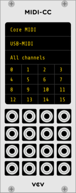
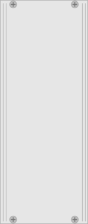

# Core

The *Core* plugin (built into Rack itself) includes utilities and interfaces for interfacing between virtual and hardware realms.

- [Audio](#audio)
- [MIDI Interfaces](#midi-interfaces)
	- [MIDI-1](#midi-1)
	- [MIDI-4](#midi-4)
	- [MIDI-CC](#midi-cc)
	- [MIDI-Trig](#midi-trig)
- [Blank](#blank)
- [Notes](#notes)

## Audio

The *Audio* module merges the virtual Rack world with the physical hardware world.
The **INPUT** section sends up to 8 Rack signals to a hardware audio device for playback, and the **OUTPUT** section sends up to 8 hardware signals into Rack.

*Audio* currently supports the following **drivers**.
- [Core Audio](https://developer.apple.com/library/content/documentation/MusicAudio/Conceptual/CoreAudioOverview/WhatisCoreAudio/WhatisCoreAudio.html) on Mac
- [WASAPI](https://msdn.microsoft.com/en-us/library/windows/desktop/dd371455%28v=vs.85%29.aspx) on Windows
- [ASIO](https://en.wikipedia.org/wiki/Audio_Stream_Input/Output) on Windows
- [ALSA](http://alsa-project.org/main/index.php/Main_Page) on Linux
- [JACK](http://www.jackaudio.org/) on Linux
- [VCV Bridge](Bridge.html)

After a driver is selected, a particular **device** can be chosen for the driver.
If the device has more than 8 inputs or outputs, you can select the desired range of outputs, offset by a factor of 8.

The **sample rate** is the number of audio samples per second for the audio device to process.
Note that this rate is different than Rack's internal sample rate set from the [toolbar](Toolbar.html), which determines the number of samples per second for virtual Rack modules to process.
If set to different rates, sample rate conversion will occur, resulting in slightly higher CPU usage, slightly less audio fidelity, and slightly more latency.

The **block size** sets the number of samples to store in the audio buffer before releasing to the audio device.
A higher size results in more latency (`blockSize / sampleRate` seconds), but a lower size requires your operating system to communicate with the audio device more frequently, resulting in potentially less audio stability.
A good balance can be found by increasing the block size until no audio "glitches" are heard.

Note: Using multiple Audio modules is experimental and may crash Rack or render unstable audio.
Most DAWs avoid this feature entirely by restricting audio to a single input and a single output device for stability reasons, but if using multiple audio devices in Rack works with your configuration, more power to you!

## MIDI Interfaces

Each MIDI interface module (described below) supports the following drivers.
- Core MIDI on Mac
- Windows MIDI on Windows
- ALSA on Linux
- JACK on Linux
- [VCV Bridge](Bridge.html)
- Gamepad
- Computer keyboard

The *gamepad* MIDI driver allows USB video game controllers to be used for CV and gate sources, as an inexpensive alternative to MIDI controllers.
Gamepad buttons are mapped to MIDI note gates starting with `C-1`, `C#-1`, `D-1`, etc.
Joystick axes are mapped to MIDI CC messages starting with `CC0`, `CC1`, `CC2`, etc. with a nonstandard MIDI extension that allows negative CC values to be used.

The *computer keyboard* MIDI driver generates MIDI notes when keys are presses while the Rack window is focused.
Using two rows of keys, the virtual MIDI keyboard spans approximately 2½ octaves and can be shifted down and up with the `` ` `` and `1` keys.
Currently only the QWERTY (US) layout is supported, but other keyboard layouts may function similarly.

### MIDI-1

The **CV** output generates a 1V/oct pitch signal of the last held MIDI note.
**GATE** generates 10V when a key is held. It does not retrigger when notes are played legato.
**VEL** generates a CV signal from 0V to 10V of the velocity, **AFT** generates aftertouch CV (channel pressure, not polyphonic aftertouch), **PW** generates pitch wheel CV from -5V to 5V, and **MW** generates mod wheel CV.
**RTRG** generates a 1 ms trigger when a new note is pressed.
**CLK1** and **CLK2** generate triggers specified by the division set by right-clicking on the panel and selecting the *CLK 1 rate* or *CLK 2 rate*.
**STRT**, **STOP**, and **CONT** generate triggers when the MIDI hardware or DAW host (for VCV Bridge) sends a start, stop, or continue event.

### MIDI-4

MIDI-4 contains a subset of the outputs from MIDI-1, except that it handles up to four simultaneous notes.
Right-click the panel to select the polyphony mode to specify the behavior in mapping MIDI notes to four channels.
- *Reset*: Each pressed note selects the lowest available channel, or the last channel if none are available.
- *Rotate*: Each pressed note selects the next available channel, or just the next channel if none are available, wrapping around to the first channel after the fourth is reached.
- *Reuse*: If a channel with the same MIDI note has been previously used, reuse it. Otherwise, use the Reset mode behavior.
- *Reassign*: As notes are released, higher channels are reassigned to lower channels if space is available.
- *Unison*: All channels generate the same monophonic signal.

Remember that MIDI interfaces can be used simultaneously with the same driver, for example if global controls like pitch and mod wheel are needed along with polyphonic controls.

### MIDI-CC

Each output maps a MIDI CC (Continuous Controller) messages from 0 to 127 to a CV signal from 0V to 10V.
Some drivers like the gamepad driver generate nonstandard MIDI values from -128 to 127, which is mapped from -10V to 10V.
14-bit MIDI CC messages are not yet supported.

Each output can be assigned a particular CC number by clicking on the digital display corresponding to the position of the output port.
A **LRN** indicator is displayed to represent that the port is in "learn" mode.
Either type a number or move a controller to set the CC number.

### MIDI-Trig

MIDI-Trig is similar to MIDI-CC, except that it generates 10V gate signals when a particular note is held.
For MIDI sequencers and drum machines that send immediate note ON/OFF messages in sequence, a 1 ms trigger is produced.

To generate a CV signal corresponding to the velocity of the note instead of 10V, right-click on the panel and enable *Velocity* mode.
This is useful for setting the amplitude of percussive sounds for MIDI controllers with velocity-capable pads, for example.

## Blank

Useful for adding space between modules in your rack.
You can resize the panel by dragging the edges horizontally, with a minimum size of 3HP.

## Notes

Useful for adding patch notes, section titles for organization, instructions, and author information to your patches.
You can copy and paste text with Ctrl+C and Ctrl+V.
